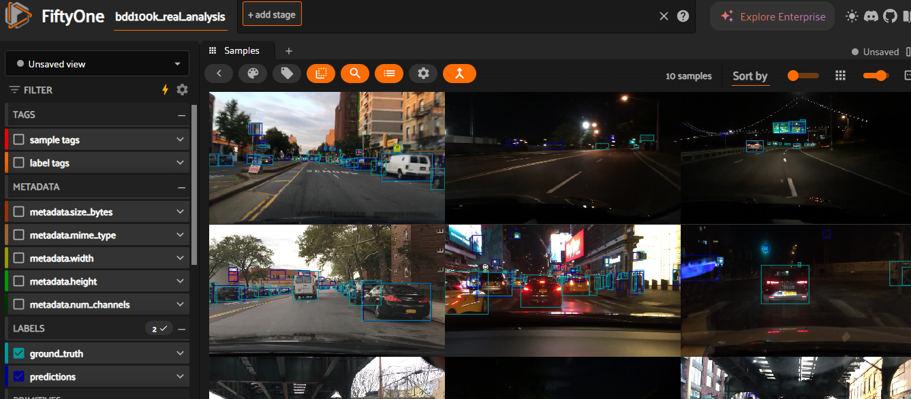

# BDD100K Object Detection Model Evaluation Framework

A comprehensive evaluation framework for BDD100K object detection models designed for autonomous driving applications with  safety-critical analysis capabilities.


### Key Features

- **6-Phase Comprehensive Analysis Pipeline** for thorough model evaluation
- **Safety-Critical Performance Focus** for autonomous driving applications
- **Advanced ML-Powered Analytics** including clustering and pattern detection

### Framework Capabilities

- **COCO-Style Evaluation** with BDD100K-specific adaptations
- **Safety-Critical Metrics** for vulnerable road users (pedestrians, cyclists, motorcycles)
- **Environmental Robustness Analysis** across weather, lighting, and scene conditions
- **Advanced Failure Analysis** with systematic categorization
- **Performance Clustering** and behavioral pattern detection

## Installation

### Prerequisites

- Python 3.8+ 
- CUDA-capable GPU (recommended for training)
- 16GB+ RAM (for large-scale analysis)
- Git and Git LFS (for model checkpoints)

### Environment Setup

```bash
# Clone the repository
git clone https://github.com/harshvardhanraju/BDD-ADAS-Analysis.git
cd BDD-ADAS-Analysis

# Create virtual environment
python -m venv venv
source venv/bin/activate  # Linux/Mac
# or
venv\Scripts\activate  # Windows

# Install dependencies
pip install -r requirements.txt

# Setup BDD100K dataset (follow BDD100K official instructions)
# Place dataset files in data/raw/bdd100k/
```

### Docker Setup (Alternative)

```bash
# Build Docker container
docker build -t bdd100k-evaluation .

# Run evaluation pipeline
docker-compose up
```

## Quick Start

### Option 1: Complete Evaluation Pipeline

Run the complete 6-phase evaluation pipeline on a trained model:

```bash
python run_complete_evaluation_1000_images.py
```

### Option 2: Individual Analysis Components

```bash
# Phase 1: Quantitative Analysis
python scripts/run_comprehensive_evaluation.py \
    --model-path checkpoints/model.pth \
    --data-dir data/analysis/processed_10class_corrected \
    --output-dir evaluation_results/phase1_quantitative

# Phase 2: Visualization Generation
python scripts/generate_evaluation_visualizations.py \
    --results-path evaluation_results/phase1_quantitative/evaluation_results.json \
    --output-dir evaluation_results/phase2_visualizations

# Phase 5: Comprehensive Reporting
python scripts/generate_comprehensive_report.py \
    --phase1-results evaluation_results/phase1_quantitative/evaluation_results.json \
    --output-dir evaluation_results/phase5_reports

# Phase 6: Improvement Recommendations
python scripts/generate_improvement_recommendations.py \
    --comprehensive-results evaluation_results/phase1_quantitative/evaluation_results.json \
    --output-dir evaluation_results/phase6_recommendations
```

### Training a Model

```bash
python scripts/train_complete_10class_detr.py \
    --epochs 50 \
    --batch-size 32 \
    --save-frequency 5 \
    --keep-checkpoints 5
```

## Framework Architecture

### 6-Phase Evaluation Pipeline

#### Phase 1: Quantitative Analysis
- COCO-style metrics (mAP, precision, recall)
- Safety-critical performance assessment
- Environmental condition analysis  
- Object size and spatial distribution analysis

#### Phase 2: Visualization Generation
- Performance dashboards and charts
- Detection sample visualizations
- Error distribution analysis
- Environmental impact visualization

#### Phase 3: Failure Analysis
- Failure pattern identification

#### Phase 4: Performance Clustering
- Similar performance pattern grouping
- cluster identification
- Pattern-based insights extraction
- Anomaly detection

#### Phase 5: Improvement Recommendations
- Prioritized improvement strategies
- Implementation roadmaps with timelines
- Cost-benefit analysis
- Technical enhancement plans

## Model Architecture

### Supported Architectures
- **DETR (Detection Transformer)** - Primary implementation
- **Facebook DETR with ResNet-50 backbone**
- **Input Resolution**: 416x416 pixels
- **Classes**: 10 BDD100K object categories

### Object Classes
1. **Pedestrian** (safety-critical)
2. **Rider** (safety-critical)
3. **Car**
4. **Truck** 
5. **Bus**
6. **Train**
7. **Motorcycle** (safety-critical)
8. **Bicycle** (safety-critical)
9. **Traffic Light**
10. **Traffic Sign**

## Safety-Critical Analysis

### Priority Classification
Safety-critical objects are prioritized for autonomous vehicle applications:

- **Pedestrian**: Highest priority for collision avoidance
- **Rider**: Motorcyclists and bicycle riders
- **Bicycle**: Two-wheeled vehicles in traffic
- **Motorcycle**: Motorized two-wheelers

### Safety Metrics
- **False Negative Rate (FNR)**: Critical for safety applications
- **Precision**: Reduces false alarms
- **Recall**: Ensures detection coverage
- **Safety Compliance**: Industry standard thresholds (FNR < 10%, Precision > 70%, Recall > 80%)

## Data Analysis

The framework includes comprehensive dataset analysis capabilities:

### Dataset Statistics
- **Total Images**: 79,863 (69,863 train + 10,000 validation)
- **Total Objects**: 1,472,397 annotated objects
- **Average Objects/Image**: 18.4
- **Data Quality**: >99.8% valid annotations

### Key Findings
- **Extreme Class Imbalance**: 5,402:1 ratio (most to least frequent classes)
- **Dominant Classes**: Cars (55.4%), Traffic Signs (18.7%), Traffic Lights (14.5%)
- **Safety-Critical Underrepresentation**: Only 8.2% of dataset
- **Multi-Scale Challenge**: 1,000x+ size variation across classes

## Repository Structure

```
BDD-ADAS-Analysis/
├── src/                           # Core framework source code
│   ├── data/                      # Data loading and preprocessing
│   ├── models/                    # Model architectures and utilities
│   ├── training/                  # Training pipeline and utilities
│   ├── evaluation/               # Evaluation metrics and analysis
│   │   ├── metrics/              # Performance metrics
│   │   ├── analysis/             # Advanced analysis tools
│   │   ├── reporting/            # Report generation
│   │   └── visualization/        # Visualization utilities
│   └── parsers/                  # Configuration parsers
├── scripts/                      # Executable scripts
│   ├── train_complete_10class_detr.py
│   ├── run_comprehensive_evaluation.py
│   ├── generate_evaluation_visualizations.py
│   ├── generate_comprehensive_report.py
│   └── generate_improvement_recommendations.py
├── data/                         # Dataset and analysis results
│   ├── analysis/                 # Comprehensive dataset analysis
│   │   ├── complete_analysis_10class/
│   │   ├── enhanced_patterns/
│   │   ├── outliers_10class/
│   │   ├── actionable_insights/
│   │   └── processed_10class_corrected/
│   └── raw/                      # Raw BDD100K dataset (not in repo)
├── evaluation_results_48epoch_complete/  # Latest evaluation results
│   ├── phase1_quantitative/      # Metrics and performance data
│   ├── phase2_visualizations/    # Charts and dashboards
│   ├── phase5_reports/           # Technical and executive reports
│   └── phase6_recommendations/   # Improvement strategies
├── evaluation_results_15epoch_complete/  # Historical results
├── evaluation_results_archive/   # Archived evaluation results
├── checkpoints/                  # Model checkpoints (local only)
├── docs/                         # Documentation
├── docker/                       # Docker configuration
└── debug/                        # Debug utilities and scripts
FiftyOne_results_analysis  -- Contains BLIP2 embeddings based advanced Failure clustering anlaysis along with GUI
```


## Evaluation Results

### Current Model Performance (48-Epoch Model)

**Overall Performance:**
- **mAP**: Extremely low (requires significant improvement)
- **Safety-Critical Performance**: Below acceptable thresholds
- **Environmental Robustness**: Consistent across conditions
- **Recommendation**: Complete model retraining required

**Key Issues Identified:**
- Near-zero detection performance across all classes
- >99% false negative rate for safety-critical classes
- Fundamental training or architecture issues
- Complete model redesign recommended

### Available Results

#### Active Results
- **`evaluation_results_48epoch_complete/`**: Latest comprehensive evaluation (recommended)
- **`evaluation_results_15epoch_complete/`**: Historical comparison data

#### Archived Results  
- **`evaluation_results_archive/`**: Historical evaluation results and experiments


## Advanced Features

### Environmental Analysis
- **Weather Conditions**: Clear, overcast, rainy, snowy performance analysis
- **Lighting Conditions**: Daytime, dawn/dusk, night performance evaluation
- **Scene Types**: Highway, residential, city street, parking lot analysis

### Failure Analysis
- **Systematic Error Categorization**: False positives, false negatives, localization errors
- **Root Cause Analysis**: Pattern identification and failure mode clustering
- **Priority-Based Improvement**: Critical issue identification and ranking

### Business Intelligence
- **Cost-Benefit Analysis**: Investment requirements and expected returns
- **Timeline Estimation**: Development effort and deployment readiness
- **Risk Assessment**: Safety and business risk evaluation
- **Resource Planning**: Engineering effort and infrastructure requirements

## Configuration

### Model Configuration
Modify model architecture and training parameters in:
- `src/models/detr_model.py` - Architecture definitions
- `scripts/train_complete_10class_detr.py` - Training hyperparameters
- Configuration files for evaluation thresholds and metrics

### Data Configuration
Customize data preprocessing and evaluation:
- `src/data/detr_dataset.py` - Data loading and preprocessing
- Data augmentation strategies and class mappings
- Evaluation subset configurations

## Citation

```bibtex
@misc{bdd100k_eval_framework,
  title={BDD100K Object Detection Evaluation Framework},
  author={Harshvardhan Raju},
  year={2024},
  publisher={GitHub},
  url={https://github.com/harshvardhanraju/BDD-ADAS-Analysis}
}
```


## Contact

- **Author**: Harshvardhan Raju
- **Project**: BDD100K Object Detection Evaluation Framework
- **Repository**: https://github.com/harshvardhanraju/BDD-ADAS-Analysis
